# Task 3: Java Application using Gradle

## Project Overview

This project implements a complete, automated Continuous Integration and Continuous Delivery (CI/CD) workflow for a Java Spring Boot REST API application using Gradle and Jenkins. The solution showcases end-to-end DevOps automation: source code compilation, dependency resolution, automated unit testing, artifact packaging, artifact archiving, automated deployment on a dedicated Linux environment, and post-deployment API health validation.

The pipeline operates across a distributed Jenkins architecture:
- Jenkins Controller: Hosted on a Windows environment to schedule, orchestrate, and manage pipeline executions.
- Jenkins Agent: Hosted on an isolated Ubuntu Linux machine (`ubuntu-agent-01`) connected via SSH, responsible for executing build tasks, running test suites, packaging JAR files, and running the application runtime.

### Key Technologies

- Java 21 LTS
- Spring Boot 3.3.4
- Gradle 8.8 (using Gradle Wrapper)
- JUnit 5 / Spring Boot Test (MockMvc)
- Git and GitHub
- Jenkins LTS
- Windows (Jenkins Controller)
- Ubuntu Linux (Jenkins Agent: `ubuntu-agent-01`)
- OpenSSH
- Embedded Tomcat Web Server (Port 8085)
- cURL (API Verification)

---

## Assignment Requirements and Objectives

1. Automate Java project builds using Gradle.
2. Manage dependencies efficiently in the Java application.
3. Integrate CI/CD pipelines for continuous delivery.
4. Streamline build and deployment processes.
5. Understand core DevOps principles in Java development.

---

## Architecture Diagrams

### System Architecture Flow

The following diagram illustrates the infrastructure separation, network communication, and execution lifecycle between the developer, GitHub, the Windows Jenkins Controller, and the Ubuntu Jenkins Agent.

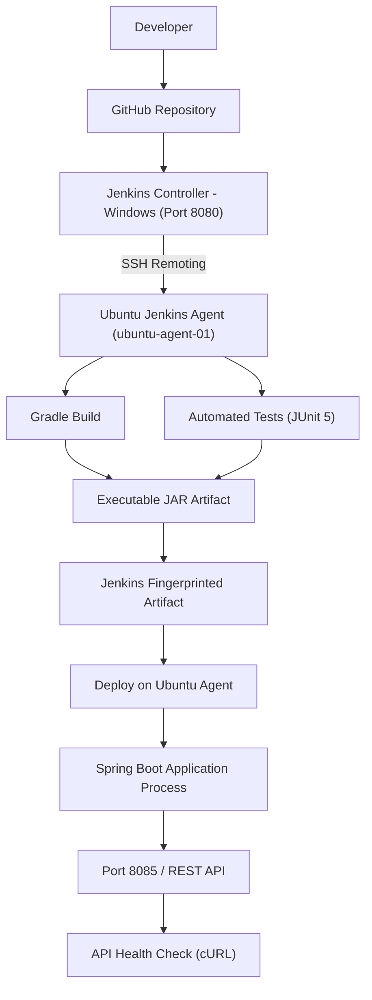

### CI/CD Pipeline Lifecycle

The automated delivery pipeline executes sequentially across four dedicated stages, terminating in an automated health check to guarantee runtime stability.

```mermaid
flowchart LR
    GitHub["GitHub"] --> Pipeline["Jenkins Pipeline"]
    Pipeline --> Checkout["1. Checkout Stage"]
    Checkout --> Build["2. Gradle Build"]
    Build --> Test["Automated Tests"]
    Test --> Package["JAR Packaging"]
    Package --> Archive["3. Archive Artifact"]
    Archive --> Deploy["4. Deploy Application"]
    Deploy --> Health["API Health Check"]
    Health --> Success["Pipeline Success"]
```

---

## Jenkins Distributed Architecture

In modern DevOps environments, building and deploying applications directly on the CI controller introduces security risks, resource competition, and potential system instability. This project utilizes a distributed Jenkins architecture.

### Jenkins Controller (Windows)
- Operating System: Windows
- Web UI Port: 8080
- Role: Pipeline scheduler, credential store, build orchestrator, and web interface.
- Operation: Detects repository updates, reads the declarative `Jenkinsfile`, and delegates stage execution to the target agent node.

### Jenkins Agent (Ubuntu Linux)
- Node Name: `ubuntu-agent-01`
- Operating System: Ubuntu Linux
- User Account: `prabavi`
- Workspace Directory: `/home/prabavi/jenkins/workspace/Java-Gradle-CI-CD`
- Communication: Secured through SSH remoting with public/private key authentication.
- Role: Isolated execution environment containing Java 21, Git, and Gradle caches. Executes all compilation, testing, packaging, and application deployment.

### Reasons for Controller-Agent Separation
- Workload Isolation: Resource-heavy compilation, testing, and daemon processes run strictly on the agent, preventing controller starvation.
- Environment Parity: Applications targeting Linux production environments are built and tested on Linux agents, eliminating platform discrepancies.
- Security: Code execution occurs inside a non-administrative user space (`prabavi`) without exposing controller host files.

---

## Environment Setup and Installation Walkthrough

The project setup was completed using the following step-by-step procedure:

1. Install Jenkins on Windows: Downloaded and installed the Jenkins LTS Windows package configured as a local service.
2. Open Jenkins on Port 8080: Accessed the Jenkins web dashboard at `http://localhost:8080` and unlocked the installation using the initial administrator password.
3. Install Suggested Jenkins Plugins: Installed standard suggested plugins including Pipeline, Git, SSH Agent, Credentials, and Workspace Cleanup.
4. Configure Jenkins: Set up administrative credentials, instance URL, and system security configurations.
5. Configure Git on Windows: Verified local Git CLI functionality and connected local repositories to GitHub.
6. Prepare Ubuntu Linux Machine: Set up the Dell Latitude 5400 laptop running Ubuntu Linux to function as a persistent build agent.
7. Install Java 21 on Ubuntu: Installed OpenJDK 21 LTS (`sudo apt update && sudo apt install openjdk-21-jdk -y`) to provide build and runtime parity.
8. Install Git on Ubuntu: Installed Git (`sudo apt install git -y`) for native agent workspace operations.
9. Configure SSH Access: Generated SSH keys on the Windows controller, added the public key to `/home/prabavi/.ssh/authorized_keys` on Ubuntu, and verified terminal connectivity over port 22.
10. Add Ubuntu as a Jenkins Agent: Navigated to `Manage Jenkins > Nodes > New Node`, configured `ubuntu-agent-01` with label `ubuntu`, specified the remote root directory `/home/prabavi/jenkins`, and attached SSH credentials.
11. Verify the Ubuntu Node is Online: Launched the agent connection via SSH and confirmed the node reported synchronized clock, detected Java 21, and remained in the `In service` state.
12. Create the Pipeline Job: Created a new Pipeline item named `Java-Gradle-CI-CD` on the Jenkins controller.
13. Configure Pipeline from SCM: Configured the job definition to use `Pipeline script from SCM`.
14. Connect the GitHub Repository: Specified the Git repository URL:
    `https://github.com/kavindugeethshan/CodeAlpha_Complete-_Jenkins_Project-Task-3.git`
    and selected the `main` branch.
15. Use the Jenkinsfile from the Repository: Pointed the Script Path to `Jenkinsfile` for automated execution upon trigger.

---

## Application Details

The backend application is a lightweight, clean Java Spring Boot REST API designed specifically to demonstrate build automation and CI/CD mechanics without unnecessary external dependencies such as databases or frontends.

- Project Name: `java-gradle-devops-app`
- Configured Port: `8085` (configured in `src/main/resources/application.properties`)
- Base Package: `com.example.javagradledevops`

### REST API Endpoints

#### Endpoint 1: Root Status
- Method: `GET`
- Path: `/`
- HTTP Status: `200 OK`
- Content-Type: `application/json`
- Response Payload:
```json
{
  "message": "Java Gradle DevOps Application is running",
  "version": "1.0.0"
}
```

#### Endpoint 2: Hello Endpoint
- Method: `GET`
- Path: `/api/hello`
- HTTP Status: `200 OK`
- Content-Type: `application/json`
- Response Payload:
```json
{
  "message": "Hello from Java Gradle Application"
}
```

#### Endpoint 3: Application Metadata
- Method: `GET`
- Path: `/api/info`
- HTTP Status: `200 OK`
- Content-Type: `application/json`
- Response Payload:
```json
{
  "application": "Java Gradle DevOps App",
  "version": "1.0.0",
  "java": "21",
  "buildTool": "Gradle"
}
```

---

## Gradle Build and Dependency Management

The project uses Gradle 8.8 managed through the Gradle Wrapper (`gradlew` and `gradlew.bat`). The wrapper ensures that any system or CI/CD agent can execute identical build tasks without requiring a pre-installed Gradle binary.

### Key Gradle Tasks

- `compileJava`: Compiles Java source files using the Java 21 compiler toolchain.
- `processResources`: Copies configuration files like `application.properties` into the build target.
- `classes`: Assembles compiled classes and processed resources.
- `test`: Executes the JUnit 5 test suite with Spring Boot test slices.
- `check`: Runs verification tasks including automated tests.
- `bootJar`: Packages the Spring Boot executable fat JAR containing compiled code, runtime libraries, and the embedded Tomcat server.
- `build`: Performs a complete lifecycle execution: compilation, testing, and packaging.

### Build Configuration (`build.gradle`)

```groovy
plugins {
    id 'java'
    id 'org.springframework.boot' version '3.3.4'
    id 'io.spring.dependency-management' version '1.1.6'
}

group = 'com.example'
version = '1.0.0'

java {
    toolchain {
        languageVersion = JavaLanguageVersion.of(21)
    }
}

repositories {
    mavenCentral()
}

dependencies {
    implementation 'org.springframework.boot:spring-boot-starter-web'
    testImplementation 'org.springframework.boot:spring-boot-starter-test'
}

tasks.named('test') {
    useJUnitPlatform()
}

bootJar {
    archiveFileName = 'java-gradle-devops-app-1.0.0.jar'
}
```

### Local Build Commands

#### On Windows:
```cmd
.\gradlew.bat clean build
.\gradlew.bat test
.\gradlew.bat bootRun
```

#### On Linux / Ubuntu Jenkins Agent:
```bash
chmod +x gradlew
./gradlew clean build
./gradlew test
```

---

## Automated Testing

Automated testing is integrated into the build lifecycle. Running `./gradlew clean build` or `./gradlew test` invokes the JUnit Platform engine and executes all test cases before packaging.

The test class `DevOpsControllerTest.java` verifies five critical conditions:
1. Application Context Load: Ensures the Spring IoC container initializes without errors.
2. Root Endpoint Verification: Validates HTTP 200 and response JSON on `GET /`.
3. Hello Endpoint HTTP Status: Validates HTTP 200 on `GET /api/hello`.
4. Hello Message Content: Validates expected JSON message structure on `GET /api/hello`.
5. Info Endpoint Metadata: Validates HTTP 200 and JSON attributes (`application`, `version`, `java`, `buildTool`) on `GET /api/info`.

The Jenkins pipeline output confirms the test execution:
```text
> Task :test
BUILD SUCCESSFUL in 1m 7s
4 actionable tasks: 4 executed
```

---

## Build Artifact Packaging

Gradle generates the executable standalone archive:
```text
build/libs/java-gradle-devops-app-1.0.0.jar
```

### Executable Spring Boot JAR vs. Plain Thin JAR
- Plain JAR: Contains only the compiled project `.class` files. Running `java -jar` fails unless all external dependencies and web servers are supplied on the classpath.
- Spring Boot Executable JAR (Fat JAR): Bundles compiled bytecode, all runtime dependencies from Maven Central, Spring framework libraries, and an embedded Apache Tomcat 10.1 web container. It runs anywhere with a standard JRE using `java -jar <filename>.jar`.

---

## Jenkins Declarative Pipeline

The deployment process is codified in `Jenkinsfile` stored directly in version control.

### Jenkinsfile Implementation

```groovy
pipeline {
    agent { label 'ubuntu' }

    options {
        skipDefaultCheckout(true)
    }

    stages {

        stage('Checkout') {
            steps {
                deleteDir()

                sh '''
                    git clone --branch main \
                    https://github.com/kavindugeethshan/CodeAlpha_Complete-_Jenkins_Project-Task-3.git .
                '''
            }
        }

        stage('Build & Test') {
            steps {
                sh '''
                    chmod +x gradlew
                    ./gradlew clean build
                '''
            }
        }

        stage('Archive JAR') {
            steps {
                archiveArtifacts artifacts: 'build/libs/java-gradle-devops-app-1.0.0.jar',
                                  fingerprint: true
            }
        }

        stage('Deploy') {
            steps {
                sh '''
                    pkill -f 'java-gradle-devops-app-1.0.0.jar' || true

                    nohup java -jar \
                    build/libs/java-gradle-devops-app-1.0.0.jar \
                    > app.log 2>&1 < /dev/null &

                    sleep 10

                    curl -f http://localhost:8085/api/hello
                '''
            }
        }
    }

    post {
        success {
            echo 'Java Gradle CI/CD pipeline completed successfully.'
        }

        failure {
            echo 'Java Gradle CI/CD pipeline failed.'
        }
    }
}
```

### Pipeline Stage Details

1. Stage: Checkout
   - Cleans the workspace (`deleteDir()`) to eliminate stale build files.
   - Executes native Git on Ubuntu to clone the `main` branch from the GitHub repository into the current agent directory.

2. Stage: Build & Test
   - Grants execute permissions to the Gradle Wrapper (`chmod +x gradlew`).
   - Executes `./gradlew clean build`, triggering compilation, dependency validation, JUnit 5 automated testing, and executable JAR generation.

3. Stage: Archive JAR
   - Archives `build/libs/java-gradle-devops-app-1.0.0.jar` into the Jenkins controller artifact storage.
   - Enables MD5 fingerprinting for artifact provenance and build traceability.

4. Stage: Deploy
   - Terminates any older running instance of the application (`pkill -f 'java-gradle-devops-app-1.0.0.jar' || true`).
   - Starts the newly packaged JAR in the background using `nohup java -jar ... > app.log 2>&1 < /dev/null &`.
   - Waits 10 seconds (`sleep 10`) to allow embedded Tomcat to complete startup on port 8085.
   - Executes an automated health verification check:
     `curl -f http://localhost:8085/api/hello`
   - If the endpoint returns HTTP 200 with the valid JSON response, the stage passes. If the endpoint fails or times out, `curl -f` returns an exit code of 1, failing the pipeline immediately.

---

## Deployment and Verification

The application is deployed on the Ubuntu Jenkins Agent listening on `http://localhost:8085`.

Verification command:
```bash
curl http://localhost:8085/api/hello
```

Received response:
```json
{"message":"Hello from Java Gradle Application"}
```

Console execution confirmation from the final Jenkins run:
```text
BUILD SUCCESSFUL
{"message":"Hello from Java Gradle Application"}
Finished: SUCCESS
```

---

## Core DevOps Concepts Demonstrated

1. Version Control: Source code, build configuration (`build.gradle`), and pipeline definitions (`Jenkinsfile`) are version-controlled in Git and hosted on GitHub.
2. Continuous Integration (CI): Every pipeline execution automates code checkout, compilation, and automated test execution to detect regressions immediately.
3. Automated Testing: Unit and integration tests run automatically before artifact creation; broken tests halt the pipeline.
4. Build Automation: The entire compilation and packaging sequence is executed programmatically through Gradle without manual intervention.
5. Dependency Management: External dependencies are declared declaratively, resolved automatically from Maven Central, and cached on the agent.
6. Artifact Management: Build artifacts are generated deterministically, archived, and fingerprinted inside Jenkins for auditing and deployment.
7. Continuous Delivery (CD): Successfully validated builds automatically proceed to packaging and staged deployment.
8. Automated Deployment: The running process is refreshed, the new application binary is started as a background daemon, and runtime logs are captured.
9. Infrastructure Separation: Controller and Agent roles are separated across distinct operating systems (Windows and Ubuntu), reflecting enterprise architecture.
10. Post-Deployment Verification: Automated HTTP health checks confirm application availability before declaring pipeline success.

---

## Requirement Mapping Table

| Requirement | Implementation | Evidence |
| :--- | :--- | :--- |
| Automate Java project builds using Gradle | Jenkins executes `./gradlew clean build` on the Ubuntu Agent | `docs/images/jenkins-final-ci-cd-success.png` |
| Manage dependencies efficiently | Spring Boot and test dependencies declared in `build.gradle` and resolved from Maven Central | `docs/images/java-gradle-devops-app-1.0.0.jar.png` |
| Integrate CI/CD pipelines | GitHub to Jenkins Controller to Ubuntu Agent pipeline executing build, test, archive, and deploy stages | `docs/images/java-gradle-cicd-run-successfull.png` |
| Streamline build and deployment | Automated pipeline with workspace cleanup, background daemon execution, and cURL health check | `docs/images/api-deployment-test.png` |
| Understand DevOps principles | Git, CI, testing, artifact management, node isolation, automated deployment, and verification | `docs/images/ubuntu-node-isolation-verify.png` |

---

## Screenshot Evidence

The following screenshots document each stage of the project setup, node configuration, local testing, artifact generation, and final pipeline execution.

### Phase 1: Environment and SSH Connectivity

#### 1. SSH Connection to Ubuntu Linux Agent

*Proves successful SSH authentication and connectivity from the Windows environment to the Ubuntu Linux host.*

---

### Phase 2: Jenkins Controller Setup

#### 2. Jenkins Controller Installation and Configuration
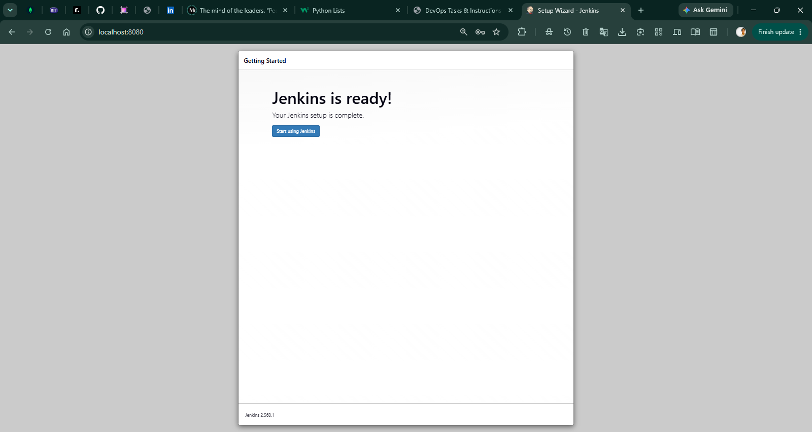
*Proves the Jenkins Controller was successfully installed, unlocked, and configured on the Windows machine.*

#### 3. Jenkins Suggested Plugins Installation
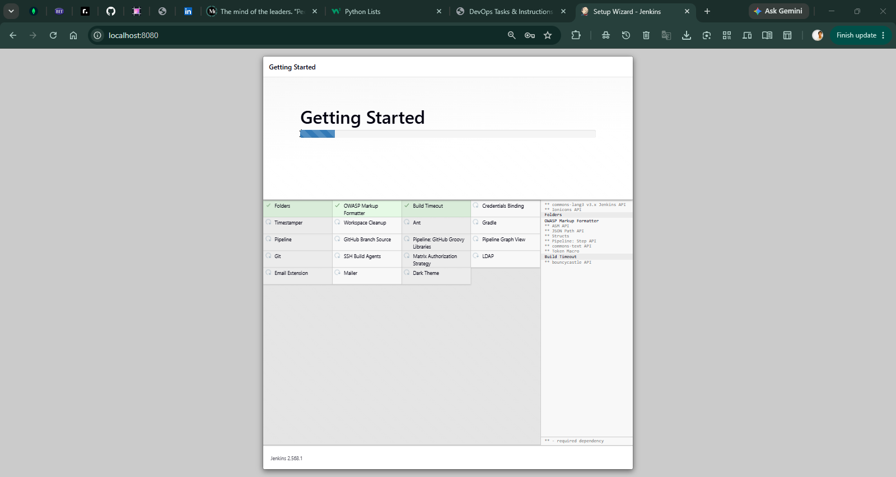
*Proves the standard Jenkins plugin suite was installed to enable Git, Pipeline, and SSH Agent capabilities.*

#### 4. Windows Environment Initial Build Verification

*Proves Jenkins job execution capability on the controller host prior to agent provisioning.*

---

### Phase 3: Ubuntu Agent Configuration and Node Isolation

#### 5. Ubuntu Agent Node Provisioning
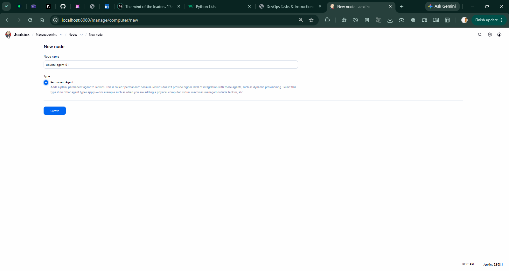
*Proves the registration and provisioning process of the Ubuntu agent node inside Jenkins.*

#### 6. Ubuntu Node Successfully Created

*Proves the `ubuntu-agent-01` node was successfully added to the Jenkins node list and marked active.*

#### 7. Ubuntu Node Isolation and Verification

*Proves node isolation: the build executes in the dedicated `/home/prabavi/jenkins` directory on Ubuntu.*

---

### Phase 4: Local Application and API Verification

#### 8. Local REST API Verification
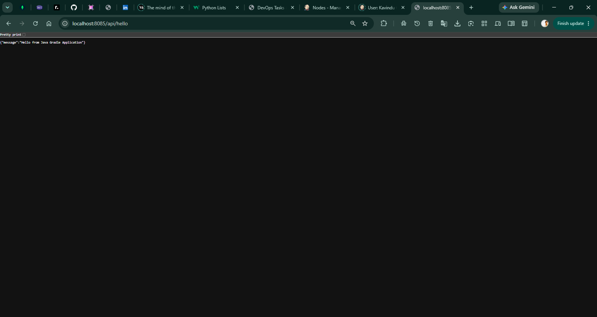
*Proves the Spring Boot application starts correctly and responds to REST requests during local development.*

---

### Phase 5: Pipeline Execution, Artifact Generation, and Deployment

#### 9. Spring Boot Application Started on Ubuntu Agent
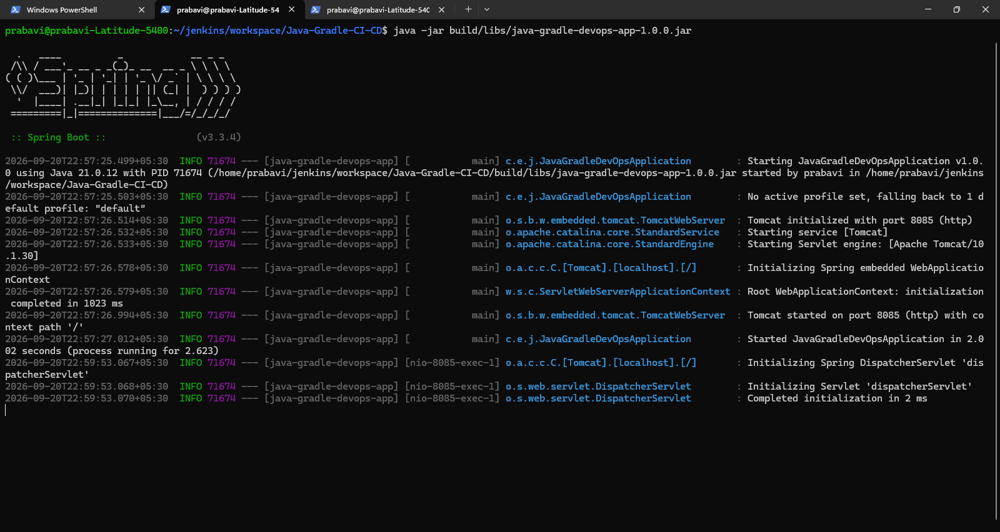
*Proves the Spring Boot application successfully started on the Ubuntu Jenkins Agent and initialized Tomcat on port 8085.*

#### 10. API Deployment Health Check
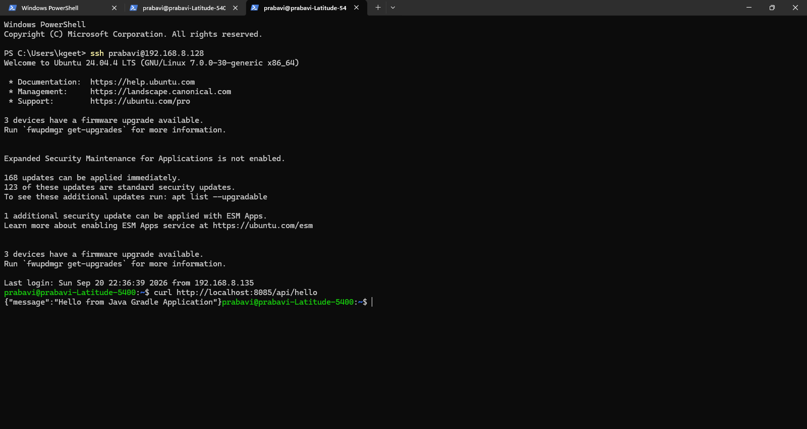
*Proves the deployed application responds to `curl http://localhost:8085/api/hello` with HTTP 200 and `{"message":"Hello from Java Gradle Application"}`.*

#### 11. Generated Executable JAR Artifact
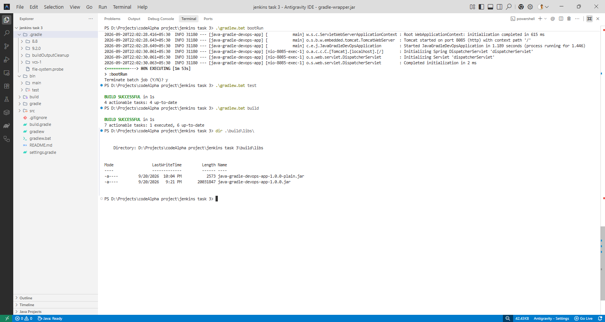
*Proves Gradle successfully created the standalone executable JAR `java-gradle-devops-app-1.0.0.jar` in `build/libs/`.*

#### 12. Complete CI/CD Pipeline Execution
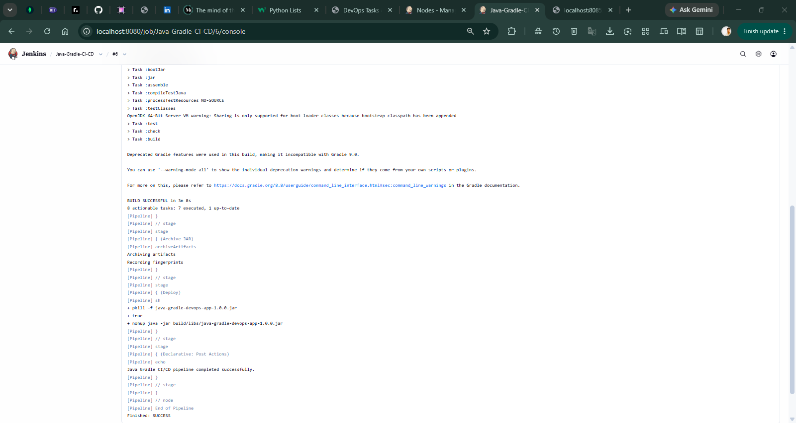
*Proves the entire Jenkins pipeline successfully completed all stages (Checkout, Build & Test, Archive JAR, Deploy).*

#### 13. Final Pipeline Console Success Output
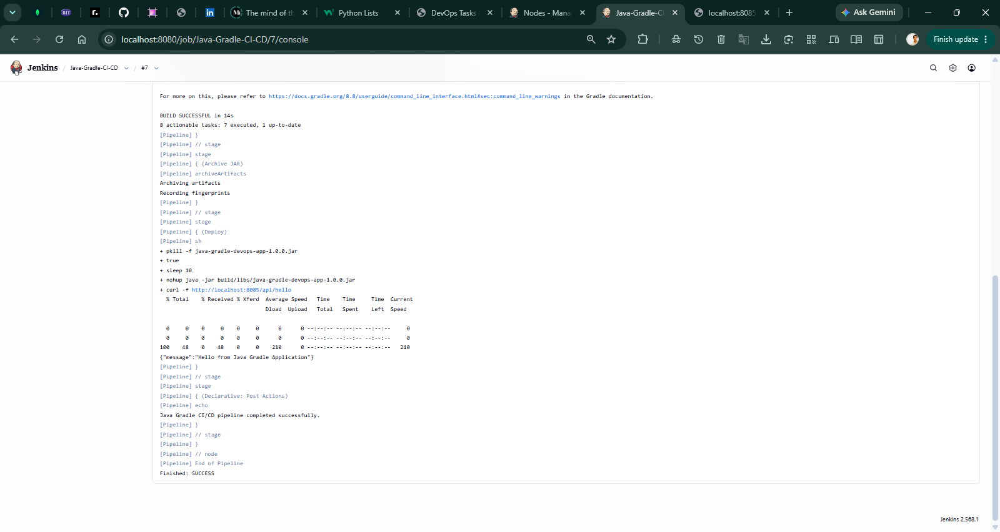
*Proves the final console log completed with `BUILD SUCCESSFUL`, valid API health check response, and status `Finished: SUCCESS`.*

---

## Final Results and Conclusion

The implementation of Task 3 achieved the following verified outcomes:
- Successfully configured a multi-node distributed Jenkins infrastructure separating controller orchestration (Windows) from agent execution (Ubuntu).
- Automated the Java 21 Spring Boot build lifecycle using the Gradle 8.8 Wrapper.
- Executed automated unit and integration tests using JUnit 5 and Spring Boot Test with zero failures.
- Generated a self-contained, executable Spring Boot JAR archive (`java-gradle-devops-app-1.0.0.jar`).
- Archived and fingerprinted the deployment artifact directly inside Jenkins for build provenance.
- Deployed the application to the Ubuntu agent environment running on port 8085.
- Verified runtime application health automatically using `curl` as part of the pipeline deployment gate.
- Codified the complete deployment lifecycle in a version-controlled `Jenkinsfile`.

---

## Author

Kavindu Geethshan Subasingha

GitHub:
https://github.com/kavindugeethshan

Repository:
https://github.com/kavindugeethshan/CodeAlpha_Complete-_Jenkins_Project-Task-3.git
